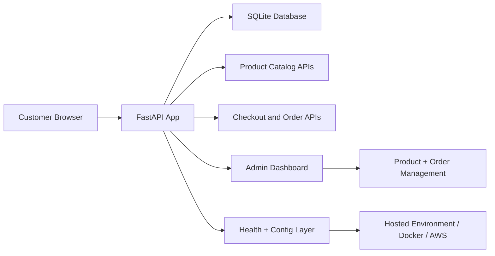

# Northstar Market

<p align="center">
  
  
  
  
</p>

<p align="center">
  <strong>Developed and maintained by Ganesh Kumar Maddi</strong>
</p>

Northstar Market is a modern, full-stack retail storefront built with FastAPI, SQLite, and server-rendered frontend templates. It simulates a real-world commerce workflow with product browsing, cart management, checkout, admin inventory control, review management, and deployment-ready configuration for cloud hosting.

## Table of contents

- [Overview](#overview)
- [Key features](#key-features)
- [Tech stack](#tech-stack)
- [Architecture](#architecture)
- [Project structure](#project-structure)
- [Quick start](#quick-start)
- [Admin access](#admin-access)
- [Environment configuration](#environment-configuration)
- [Deployment](#deployment)
- [Testing](#testing)
- [Ownership](#ownership)

## Overview

This project is designed as a polished, lightweight commerce application that can run locally for demos and scale toward a hosted deployment pipeline. It combines a Python backend, SQLite persistence, admin tooling, and a responsive storefront UI into a single, easy-to-run solution.

The platform supports:

- catalog browsing and product search
- cart and checkout workflow
- order tracking and confirmation pages
- admin inventory management
- product review handling
- environment-driven configuration for cloud deployment

## Key features

| Feature | Description |
| --- | --- |
| Storefront UI | Shop landing page, product detail pages, order flow, and client-side interactions |
| Product catalog | Search, category filtering, and product metadata with review support |
| Cart and checkout | Checkout API with customer and payment payload handling |
| Order tracking | Recent orders, history lookup, and confirmation pages |
| Admin dashboard | Product create/edit/delete, order status updates, and secure admin session handling |
| SQLite database | Persistent product, order, category, and review storage |
| Cloud-friendly config | Port override, environment-based secrets, and container-ready startup |
| Health checks | `/health` endpoint for hosting and deployment validation |

## Tech stack

| Layer | Stack |
| --- | --- |
| Backend | Python, FastAPI, Uvicorn |
| Database | SQLite |
| Frontend | Jinja2 templates, vanilla JavaScript, CSS |
| Validation | Pytest, HTTPX |
| Deployment | Docker, Docker Compose, AWS ECS-ready packaging |

## Architecture



## Project structure

```text
northstar-market/
├── app/
│   ├── __init__.py
│   ├── config.py
│   ├── database.py
│   ├── main.py
│   ├── models.py
│   └── schemas.py
├── frontend/
│   ├── static/
│   └── templates/
├── aws/
│   └── ecs-task-definition.json
├── scripts/
│   └── deploy-aws.sh
├── tests/
├── .env.example
├── .dockerignore
├── .gitignore
├── Dockerfile
├── docker-compose.yml
├── requirements.txt
├── README.md
└── LICENSE
```

## Quick start

### 1) Create a virtual environment

```bash
python -m venv .venv
source .venv/bin/activate
```

### 2) Install dependencies

```bash
pip install -r requirements.txt
```

### 3) Start the application

```bash
python -m uvicorn app.main:app --reload
```

### 4) Open the app

```text
http://localhost:8000
```

## Admin access

The default admin credentials are:

- Username: `admin`
- Password: `admin123`

Admin pages include:

- `/admin/login`
- `/admin`
- inventory management workflow
- order status updates

## Environment configuration

The app reads settings from environment variables and supports hosting-friendly configuration.

| Variable | Purpose |
| --- | --- |
| `APP_ENV` | Runtime environment label |
| `PORT` | HTTP port for hosted environments |
| `SESSION_SECRET_KEY` | Session signing secret |
| `ADMIN_USERNAME` | Admin username override |
| `ADMIN_PASSWORD` | Admin password override |

Example:

```bash
export APP_ENV=production
export PORT=8080
export SESSION_SECRET_KEY=your-very-strong-secret
export ADMIN_USERNAME=admin
export ADMIN_PASSWORD=securepassword
```

## Deployment

### Docker

```bash
docker compose up --build
```

### AWS / container hosting

This project is structured to work with container deployments and has cloud-ready startup patterns.

```bash
export AWS_REGION=us-east-1
export AWS_ACCOUNT_ID=123456789012
bash scripts/deploy-aws.sh
```

The repository includes a sample ECS task definition and deployment helper script for AWS-based deployment.

## Testing

Run the test suite:

```bash
pytest -q
```

This project includes API and application tests to validate product, order, admin, and health-related workflows.

## Ownership

This repository was created and developed as a personal project by Ganesh Kumar Maddi.

The project is structured as a production-style storefront demo with practical e-commerce patterns, clean deployment-friendly configuration, and a polished developer-facing presentation.

## License

This project is provided for educational, demonstration, and portfolio purposes. Add a formal license if you plan to distribute or commercialize it.
